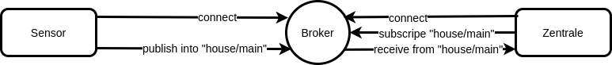
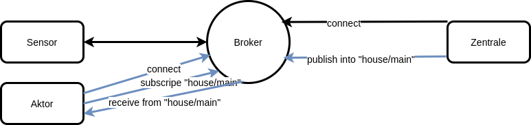
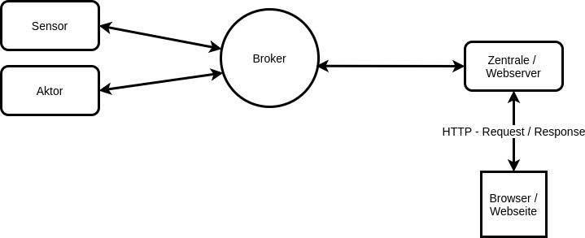
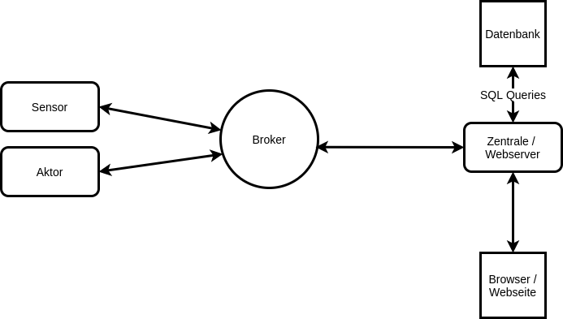
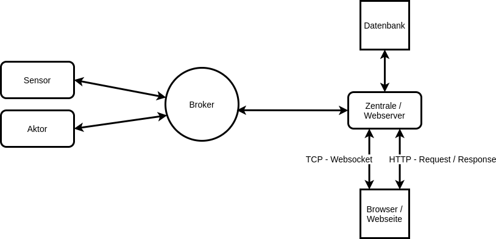

# Belegarbeit - Entwicklung einer Demoanwendung für die Lehre unter verwendung von MQTT

## Motivation MQTT
Mit der Industrie 4.0 und dem Internet der Dinge steigt der Grad der Vernetzung stetig an. Eines der gängigen Kommunikationsprotokolle im industriellen Umfeld ist OPC UA, welches vom Umfang her sehr mächtig ist und features, wie Adressraum, Alarm und Event management, Zugriffskontrolle etc. anbietet. Dieser Umfang macht OPC UA sehr flexibel, impliziert aber auch einen größeren Overhead als zum Beispiel MQTT. So kommt es das MQTT in einem Szenario, wo nur der Datenaustausch über Publish/Subscribe mit sehr vielen Teilnehmern betrachtet wird, um einiges schneller ist als OPC UA [3]. Größter Vorteil von MQTT ist dabei das Senden einer Nachricht an mehrere Clients. [3] Somit ist MQTT auch für Automatisierer relevant und Ziel dieser Arbeit ist es ein Lehrbeispiel zu entwickeln, welches die Eigenschaften von MQTT aufzeigt.

## Anforderungen an die Demoanwendung
- MQTT: verwendung von Quality of Service Leveln (QOS)
   - ermöglichen die Zustellparameter einzelner Nachrichten zu individualisieren
   - 0..höchstens einmal, 1..mindestens einmal, 2..genau einmal
- MQTT: Konfiguration eines letzen Willens
   - wird von MQTT-Sender beim Verbindungsaufbau zum Broker definiert
   - Broker führt letzen Willen bei Verbindungsabbruch des Senders aus
- Sicherheitsaspekte der Anwendung
   - alle Nachrichten werden unverschlüsselt versendet
   - das Projekt sieht keine Sicherheitsmechanismen vor
- Software Simmulierte Sensoren
   - midestens 3 in Software simmulierte Sensoren
   - generieren Zufallswerte und versenden diese via MQTT
- Physische Sensoren
   - ein Sensor soll als physische Komponente realisiert werden
   - versenden von realen Messwerten via MQTT
- Skalierbarkeit / Modulariät
   - das System soll mit beliebig vielen Sensoren erweiterbar sein
- Geringer Overhead - einfache Paketstruktur
   - Die Kommunizierten Nachrichten beinhalten nur relevante Informationen
   - Dazu zählen:
      - **UUID** zur eindeutigen Kennung des Sensors
      - **SensorType** als Kennung um welche Art Sensor es sich handelt
      - **Value** der zu übermittelde Messwert
- Visualisierbakeit / Nutzerinteraktion
   - Die Werte der Sensoren sollen über Web Oberfläche einsehbar sein
   - Aktoren sollen Instruktionen über dieses Interface erhalten
   - Nutzer soll in der lage sein, Steuergrößen anzugeben

## Entwurf der Demoanwendung

Schritt 1: Kommunikationspartner
- Sensoren und Zentrale wollen mit einander interagieren
 
---

Schritt 2: Der Broker als Vermittler
- wird als Vermittler in die Kommunikation eingebunden
- Sender verbindet sich zum Broker und schickt (Publisht) Nachrichten in einen Kanal (bei MQTT Topic genannt)
- Empfänger verbindet sich ebenfalls zum Broker und lauscht im gleichen Kanal (bei MQTT E. subscripted einer TOPIC)

---
 
Schritt 3: Aktoren
- Die Zentrale kann auch als Sender agieren um einem Aktor Sollwerde zukommen zu lassen
- gleiches Prinzip nur mit umgekehrten Rollen

---
 
 Schritt 4: Die Zentrale als Webserver
- besteht aus einem Webserver
- stellt Webseite bereit

---
 
Schritt 5: Datenbank
- speichert Messwerte der Sensoren
- Daten werden zur erstellung von Diagrammen verwendet (z.B. Temperaturverlauf)

---
Schritt 6: Web Socket
- wird verbunden um das Frontend immer mit den neusten Werten zu versorgen
- verhindert ein ständiges Neuladen der Seite

## Werkzeuge
- **C++** - Verwendete Arduino Bibliotheken für den ESP8266
   - DHT_Sensor_Library
      - erleichtert das auslesen von Messwerten eines DHT11 Sensors
      - dazu zählt Temperatur und Luftfeuchtigkeit
   - PubSubClient
      - ermöglicht das Empfangen und Versenden von MQTT Nachrichten
   - ArduinoJson
      - Variablen in JSON String verpacken
- **Python** - Verwendete Bibliotheken für alle Scripte
   - PahoMQTT
      - ermöglicht in MQTT Nachrichten zu senden und zu empfangen
   - SQLAlchemy
      - ermöglicht das senden von SQL Anfragen an eine Datenbank
      - notwendig zum speichern und abrufen von Sensorwerten
   - Flask
      - Framework um Python als Webserver zu nutzen
      - Stellt HTML Seiten bereit
      - Dient als Kommunikationsparter für eine Websocket Verbindung mit dem Frontend
   - Plotly
      - kann aus Datenstrukturen Diagramme erstellen und als HTML Seite exportieren
